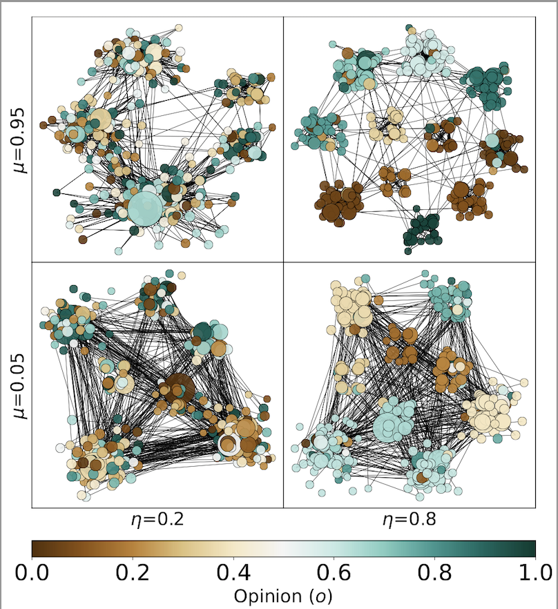
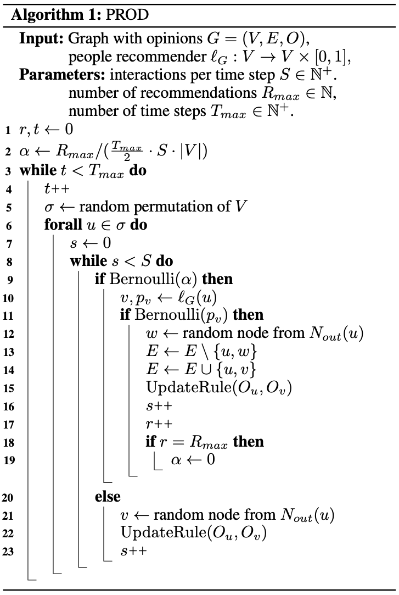
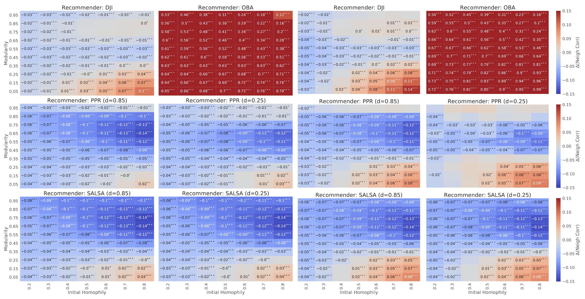
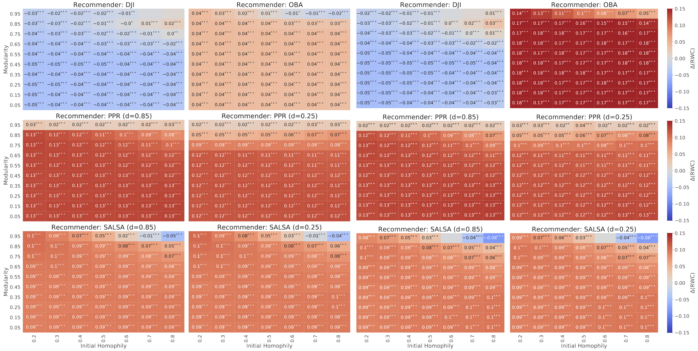

Paper ["The Effect of People Recommenders on Echo Chambers and Polarization"](https://arxiv.org/abs/2112.00626) preprint is out on arXiv.
Joint work with Federico Cinus, Corrado Monti and Francesco Bonchi from ISI Foundation. It follows a distilled extract of the full-length paper.

## Introduction

This paper aims to provide a systematic and robust framework to assess the net contribution of people-recommender algorithms to the opinion dynamics.
The current debate on which is the role of online social networks in the polarization of western societies has attracted the attention of both scholars, politicians \[1\], and public opinion \[2\].

People recommenders are at the core of services such as Twitter 'Who To Follow', Facebook 'People You May Know', etc. and are of special interest, as they directly contribute to the evolution of the social network structure, affecting the information and the opinions users are exposed to. 

   Twitter Recommender     |   Facebook Recommender
:-------------------------:|:-------------------------:
   |  

For researchers outside social media companies, it is almost impossible to put up a real-world experiment (i.e.: sort of A/B test) to quantify the influence of a recommender, all else being equal. And even for them, online experiments are quite unappealing since there is a high risk of hurting the user experience.

These are the main reasons that have driven our efforts to devise a synthetic - but still robust and realistic - framework to measure the effect of people recommenders.

## Basic components

The first ingredient of this work is the random network model. We have adapted the Lancichinetti-Fortunato-Radicchi benchmark [3] to generate synthetic social graphs with a tunable amount of initial homophily and modularity. The realistic properties of this procedure are well-established in the original work [3].

|  | 
|:--:| 
|  Examples of graphs and opinions obtained with the random network model in four corner cases of the parameter space (homophily η on the x-axis, modularity μ on the y-axis) |

Second, we devise a procedure that allows us to transparently plugin whatever recommender and opinion-dynamics model and assesses the long-term consequences in terms of network structure and opinions.

|  | 
|:--:| 
| For a number of timesteps _Tmax_, nodes are visited sequentially in random order (lines 3-5). At each time step, every node interacts with _S_ other nodes, according to the update rule of the opinion dynamics model. There are two ways interactions can happen: through newly created links (lines 10-19) or through pre-existing links (lines 20-23). In the former case, the ODM and the link recommender work jointly, while the latter case is a typical step of an ODM. |

An important remark is that we have considered the concept of _attention budget_: since time and attention are limited resources, users interact with a small set of neighbors \[4\], even if nominally they declare a larger number of friends on social media. Thus, we paired the emergence of a new connection due to the recommender with the deletion of a pre-existing connection implementing a _rewiring mechanism_ (lines 12-13). This also allows us to delimit the observed dynamics to the recommender effect rather than to the density increment caused by adding new edges.

## Evaluation method

To evaluate the effect of a given recommender algorithm on echo chambers and polarization using PROD, we have proposed the following evaluation methodology:

   1. Consider a grid of parameters μ, η, representing networks with different modularity and initial homophily.
   2. For each pair of parameters μ, η generate a sequence  of _K_ random graphs with opinions.
   3. On each graph , run PROD without any recommender algorithm (i.e., with Rmax = 0), obtaining a network .
   4. Then, on each graph , run PROD with the studied recommender algorithm l, obtaining .
   5. Considering a metric _m_ for echo chambers or polarization, compute .
   6. Assess the average difference _∆m_ between the two cases. Since the initial measure _m(G)_ is the same with and without recommender, we obtain .
   7. Perform a Kolmogorov-Smirnov test comparing the distribution of differences in the two cases, determining whether the observed effect is statistically significant.

### Measures

#### Neighbor Correlation Index (NCI)

We define NCI as the Pearson correlation  between the opinion vector _o_, and the average opinion of each node’s neighbors, that is: 

#### Random Walk Controversy (RWC)

Given two disjoint components of the graph X and Y , the Random Walk Controversy score is:

where  is the probability for a random walker that ends in partition _j_ to have started in partition _i_. In our case, we define _X_ (resp._Y_) as the set of nodes with opinion  (resp. ).

## Results

### Findings on echo chambers

|  | 
|:--:| 
| ∆NCI for the epistemological model (left half) and for the BCM model (right half). Each heatmap represents a given recommender and colors represent ∆NCI under different initial conditions (homophily η on x-axis, modularity μ on y-axis). Numbers are shown when the difference is statistically significant (p < 0.05). Asterisks further represent levels of significance (** is p < 0.01, *** is p < 0.001).|

We find that all the recommenders significantly increase echo chambers for some initial conditions. In particular, we always observe an increase when the following two conditions are met:

   i. Homophilic links—i.e., links connecting nodes with the same opinion are at least half of the initial links of the network (i.e., η > 0.5).
   
   ii. The initial network is not already segregated in polarized communities, but there is a large fraction of inter-community links (i.e., μ < 0.3).
For this type of network (highly homophilic, but not well modularized) the effect of people recommenders is always to increase echo chambers, w.r.t. a scenario where no algorithm was introduced. 

### Findings on polarization

|  | 
|:--:| 
| ∆RWC for the epistemological model (left half) and for the BCM model (right half). Each heatmap represents a given recommender and colors represent ∆RWC under different initial conditions (homophily η on x-axis, modularity μ on y-axis). Numbers are shown when the difference is statistically significant (p < 0.05). Asterisks further represent levels of significance (** is p < 0.01, *** is p < 0.001).|

Results are very different between Jaccard Index and random walk-based recommenders, Personalized PageRank and SALSA, for all initial conditions. In the general case, while the former type of recommenders obtains a small negative effect on polarization w.r.t. the null model, the latter is increasing it significantly. We hypothesize the difference is caused by the underlying algorithm mechanisms, Directed Jaccard favors immediate neighbors while random-walk based recommenders consider within-community users also at higher distances. In the latter case, this ends up increasing the separation between the different communities. 
Finally, we highlight that for PPR and SALSA the increasing effect holds in all regions of the initial condition space, except for already polarized networks (high μ, high η). In this case, we observe a saturation phenomenon: the recommender has a smaller effect (for PPR) or even negative (for SALSA) on polarization w.r.t. the null model.  Instead, when DJI starts from such a polarized network, it is the only case when it contributes to further polarization, by amplifying the initial separation.
  
  
## Intervention policies

We have also explored how to use our framework to evaluate the impact of intervention policies in the context of mitigation of echo-chamber and polarization effects. We defined three intervention procedures working on top of the recommender system. In particular, given an edge from the recommender, we replace it, with probability ξ, with another edge selected according to a probability _p_; more precisely, this probability relies on one of the following strategies:

   1. Random uniform strategy: _p_ is uniform over the non existing edge set. The original recommendation is therefore modified in order to pursue serendipity.
   2. Opinion diversity strategy: _p_ is proportional to the opinion difference of the nodes, i.e. ; here, we try to bridge individuals belonging to different echo chambers.
   3. Degree-based strategy: _p_ is higher for nodes with higher degrees, according to a sigmoid: 
, where _x_ is the in-degree of the recommended node and  is the average in-degree of the network); the idea is to leverage popular individuals to break echo chambers, as suggested by \[5\].

|  | 
|:--:| 
| ∆NCI (first row) and ∆RWC (second row) as a function of the intervention probability ξ, for each intervention procedure and each model: BCM (left half) and Epistemological (right half).|

We test these three strategies on top of the personalized PageRank algorithm. They show that the in-degree strategy and the uniform strategy have a comparable impact in reducing the echo chamber effect, with a slightly better effect for the latter. As expected, the opinion-based strategy results to be more effective because it directly targets the opinions divergence between the users, and this effect is more prominent in terms of the correlation metric (NCI). Furthermore, we observe that even low values of intervention probability are already sufficient for reversing the effect on both metrics.

## Conclusions

Our findings are robust across the different opinion dynamics models and people recommenders tested. We show that the effect of such algorithms is remarkable w.r.t. the null-model and prominent when certain initial conditions are met. The emergence of echo chambers is mostly reinforced by such algorithms when the graph structure is not already modularized, but homophilic connections are prevalent; this finding is consistent for all algorithms, even if with different magnitudes. The overall polarization shows an increasing trend when the graph is not modularized and tends to a saturation point — with a slightly positive or sometimes negative effect — when the initial conditions are of high homophily and segregation. In this regard, we can highlight a significant difference across recommenders. We argue that such differences are a result of the tendency of some recommenders to focus on local neighborhoods rather than the global structure.

From an applicative perspective, our framework could be used as a guideline to design and analyze other existing algorithms to assess their interplay with echo chambers. For instance, it can be used to evaluate algorithms able to mitigate echo-chamber effects. We sketched how such an analysis can work, by comparing the effect of possible intervention strategies.

References:

\[1\]: https://www.politico.eu/article/european-commission-disinformation-facebook-google-twitter/

\[2\]: https://www.nytimes.com/2021/10/22/technology/facebook-election-misinformation.html

\[3\]: Lancichinetti, A., Fortunato, S., & Radicchi, F. (2008). Benchmark graphs for testing community detection algorithms. Physical review E, 78(4), 046110.

\[4\]: Golder, S. A., Wilkinson, D. M., & Huberman, B. A. (2007). Rhythms of social interaction: Messaging within a massive online network. In Communities and technologies 2007 (pp. 41-66). Springer, London.

\[5\]: Elmas, T., Hardi, K., Overdorf, R., & Aberer, K. (2020). Can Celebrities Burst Your Bubble?. arXiv preprint arXiv:2003.06857.
